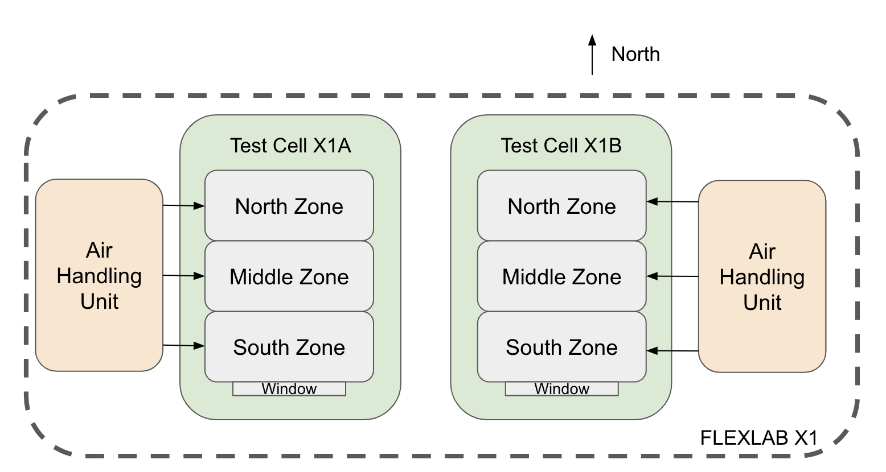

# Hardware In the Loop for Demand Flexibility (HIL4DF) v1.0

## Copyright

Hardware In the Loop for Demand Flexibility (HIL4DF) Copyright (c) 2024, 
The Regents of the University of California, through Lawrence Berkeley National Laboratory (subject to receipt of any required approvals from the U.S. Dept. of Energy). All rights reserved.

If you have questions about your rights to use or distribute this software,
please contact Berkeley Lab's Intellectual Property Office at
IPO@lbl.gov.

NOTICE.  This Software was developed under funding from the U.S. Department
of Energy and the U.S. Government consequently retains certain rights.  As
such, the U.S. Government has been granted for itself and others acting on
its behalf a paid-up, nonexclusive, irrevocable, worldwide license in the
Software to reproduce, distribute copies to the public, prepare derivative 
works, and perform publicly and display publicly, and to permit others to do so.

## License

HIL4DF is available under the following [license](https://github.com/LBNL-ETA/HIL4DF/blob/main/License.txt). 

## Summer 2021 Test Data Documentation

The Modelica models can be found at HIL4DF/ hil_flexlab_model/Test1/Examples.

For the trim-and-respond control sequence, in the FLEXLAB experiment, there was no "trimming" when “responding,” despite the initial assumption that when “trimming,” there is also “responding,” as specified in Guideline 36 (ASHRAE 2018). Another control implementation difference was that the supply air temperature trim-and-respond setpoint in the FLEXLAB experiment did not depend on outdoor air temperature, contrary to the initial assumption that the supply air temperature trim-and-respond setpoint depends on outdoor air temperature, as per Guideline 36 (ASHRAE 2018).

Within HIL4DF/ hil_flexlab_model/Test1/Examples, the Modelica “.mo” models without the “_standardized” suffix are calibrated to the FLEXLAB experiment with the trim-and-respond control sequence that doesn’t align with ASHRAE 2018. The Modelica models with the “_standardized” suffix align with ASHRAE 2018 and are different from the FLEXLAB setup. 

Datasets include files “HIL2021_x1a.csv” and “HIL2021_x1b.csv”. They can be found at HIL4DF/hil_flexlab_model/Resources/FlexlabData.

The test was performed in FLEXLAB Building X1. The FLEXLAB building setup is shown in Figure 1. FLEXLAB X1 contains 2 identical test cells, X1A and X1B. Each of X1A and X1B contains 3 zones, north zone, middle zone, and south zone. Each of X1A and X1B was served by an identical air handling unit, respectively. 

Figure 1: Setup of FLEXLAB X1 Building.

The FLEXLAB test starts on August 15th, 2021, and ends on September 13th, 2021. Table 1 shows the FLEXLAB test schedule for 6 different scenarios: non_Guideline_36+no_demand_flexibility (non_G36+no_DF), non_G36+shed, non_G36+shift, G36+no_DF, G36+shed, and G36+shift. 

More information about the FLEXLAB setup can be found in the paper of this FLEXLAB experiment. 

Table 1: Test data schedule for 6 different scenarios with legend included: non_Guideline_36+no_demand_flexibility (non_G36+no_DF), non_G36+shed, non_G36+shift, G36+no_DF, G36+shed, and G36+shift. 

<table>
  <tr>
   <td>Date
   </td>
   <td>1A FLEXLAB Schedule
   </td>
   <td>1B FLEXLAB Schedule
   </td>
  </tr>
  <tr>
   <td>8/15/2021
   </td>
   <td>non_G36+no_DF
   </td>
   <td>G36-no_DF
   </td>
  </tr>
  <tr>
   <td>8/16/2021
   </td>
   <td>non_G36+shed
   </td>
   <td>invalid day
   </td>
  </tr>
  <tr>
   <td>8/17/2021
   </td>
   <td>non_G36+shed
   </td>
   <td>invalid day
   </td>
  </tr>
  <tr>
   <td>8/18/2021
   </td>
   <td>non_G36+shed
   </td>
   <td>invalid day
   </td>
  </tr>
  <tr>
   <td>8/19/2021
   </td>
   <td>non_G36+shed
   </td>
   <td>invalid day
   </td>
  </tr>
  <tr>
   <td>8/20/2021
   </td>
   <td>non_G36+no_DF
   </td>
   <td>G36+shed
   </td>
  </tr>
  <tr>
   <td>8/21/2021
   </td>
   <td>non_G36+no_DF
   </td>
   <td>G36+shed
   </td>
  </tr>
  <tr>
   <td>8/22/2021
   </td>
   <td>non_G36+shed
   </td>
   <td>G36+shed
   </td>
  </tr>
  <tr>
   <td>8/23/2021
   </td>
   <td>non_G36+shed
   </td>
   <td>G36+shed
   </td>
  </tr>
  <tr>
   <td>8/24/2021
   </td>
   <td>invalid day
   </td>
   <td>G36+no_DF
   </td>
  </tr>
  <tr>
   <td>8/25/2021
   </td>
   <td>invalid day
   </td>
   <td>G36+no_DF
   </td>
  </tr>
  <tr>
   <td>8/26/2021
   </td>
   <td>invalid day
   </td>
   <td>G36+shift
   </td>
  </tr>
  <tr>
   <td>8/27/2021
   </td>
   <td>invalid day
   </td>
   <td>invalid day
   </td>
  </tr>
  <tr>
   <td>8/28/2021
   </td>
   <td>non_G36+shift
   </td>
   <td>G36+shift
   </td>
  </tr>
  <tr>
   <td>8/29/2021
   </td>
   <td>non_G36+shift
   </td>
   <td>G36+shift
   </td>
  </tr>
  <tr>
   <td>8/30/2021
   </td>
   <td>G36+no_DF
   </td>
   <td>G36+shift
   </td>
  </tr>
  <tr>
   <td>8/31/2021
   </td>
   <td>G36+no_DF
   </td>
   <td>G36+shift
   </td>
  </tr>
  <tr>
   <td>9/1/2021
   </td>
   <td>invalid day
   </td>
   <td>invalid day
   </td>
  </tr>
  <tr>
   <td>9/2/2021
   </td>
   <td>G36+no_DF
   </td>
   <td>G36+no_DF
   </td>
  </tr>
  <tr>
   <td>9/3/2021
   </td>
   <td>G36+no_DF
   </td>
   <td>G36+no_DF
   </td>
  </tr>
  <tr>
   <td>9/4/2021
   </td>
   <td>non_G36+no_DF
   </td>
   <td>G36+shift
   </td>
  </tr>
  <tr>
   <td>9/5/2021
   </td>
   <td>non_G36+no_DF
   </td>
   <td>G36+shift
   </td>
  </tr>
  <tr>
   <td>9/6/2021
   </td>
   <td>non_G36+shift
   </td>
   <td>G36+shift
   </td>
  </tr>
  <tr>
   <td>9/7/2021
   </td>
   <td>non_G36+shift
   </td>
   <td>invalid day
   </td>
  </tr>
  <tr>
   <td>9/8/2021
   </td>
   <td>G36+no_DF
   </td>
   <td>invalid day
   </td>
  </tr>
  <tr>
   <td>9/9/2021
   </td>
   <td>G36+no_DF
   </td>
   <td>G36+shift
   </td>
  </tr>
  <tr>
   <td>9/10/2021
   </td>
   <td>G36+no_DF
   </td>
   <td>G36+shed
   </td>
  </tr>
  <tr>
   <td>9/11/2021
   </td>
   <td>invalid day
   </td>
   <td>invalid day
   </td>
  </tr>
  <tr>
   <td>9/12/2021
   </td>
   <td>G36+no_DF
   </td>
   <td>G36+shed
   </td>
  </tr>
  <tr>
   <td>9/13/2021
   </td>
   <td>non_G36+shed
   </td>
   <td>G36+shed
   </td>
  </tr>
  <tr>
   <td>
   </td>
   <td>
   </td>
   <td>
   </td>
  </tr>
  <tr>
   <td>
   </td>
   <td>
   </td>
   <td>invalid days
   </td>
  </tr>
  <tr>
   <td>
   </td>
   <td>
   </td>
   <td>good days, but since outdoor air temperature is mild on these days, there is not much cooling load to perform “load shed” on these days
   </td>
  </tr>
  <tr>
   <td>
   </td>
   <td>
   </td>
   <td>good days
   </td>
  </tr>
</table>

A description of data points for the datasets “HIL2021_x1a.csv” and “HIL2021_x1b.csv” are shown in Table 2 and Table 3. 

Table 2: FLEXLAB Cell X1A data point descriptions

<table>
  <tr>
   <td><strong>point names</strong>
   </td>
   <td><strong>units</strong>
   </td>
   <td><strong>descriptions</strong>
   </td>
  </tr>
  <tr>
   <td>1-CHWRT-1
   </td>
   <td>deg-C
   </td>
   <td>FLEXLAB test cell X1A/X1B primary loop chilled water return temperature sensor
   </td>
  </tr>
  <tr>
   <td>1-CHWST-1
   </td>
   <td>deg-C
   </td>
   <td>FLEXLAB test cell X1A/X1B primary loop chilled water supply temperature sensor
   </td>
  </tr>
  <tr>
   <td>1A_desk1_6_light_power
   </td>
   <td>W
   </td>
   <td>Light power on desk 1 and desk 6 together that contributes to internal heat gain. Both desk 1 and desk 6 are in the south zone in test cell X1A.
   </td>
  </tr>
  <tr>
   <td>1A_desk1_plug_power
   </td>
   <td>W
   </td>
   <td>Plug load power on desk 1 that contributes to internal heat gain. Desk 1 is in the south zone in test cell X1A.
   </td>
  </tr>
  <tr>
   <td>1A_desk2_light_power
   </td>
   <td>W
   </td>
   <td>Light power on desk 2 that contributes to internal heat gain. Desk 2 is in the middle zone in test cell X1A.
   </td>
  </tr>
  <tr>
   <td>1A_desk2_plug_power
   </td>
   <td>W
   </td>
   <td>Plug load power on desk 2 that contributes to internal heat gain. Desk 2 is in the middle zone in test cell X1A.
   </td>
  </tr>
  <tr>
   <td>1A_desk3_light_power
   </td>
   <td>W
   </td>
   <td>Light power on desk 3 that contributes to internal heat gain. Desk 3 is in the north zone in test cell X1A.
   </td>
  </tr>
  <tr>
   <td>1A_desk3_plug_power
   </td>
   <td>W
   </td>
   <td>Plug load power on desk 3 that contributes to internal heat gain. Desk 3 is in the north zone in test cell X1A.
   </td>
  </tr>
  <tr>
   <td>1A_desk4_light_power
   </td>
   <td>W
   </td>
   <td>Light power on desk 4 that contributes to internal heat gain. Desk 4 is in the north zone in test cell X1A.
   </td>
  </tr>
  <tr>
   <td>1A_desk4_plug_power
   </td>
   <td>W
   </td>
   <td>Plug load power on desk 4 that contributes to internal heat gain. Desk 4 is in the north zone in test cell X1A.
   </td>
  </tr>
  <tr>
   <td>1A_desk5_light_power
   </td>
   <td>W
   </td>
   <td>Light power on desk 5 that contributes to internal heat gain. Desk 5 is in the middle zone in test cell X1A.
   </td>
  </tr>
  <tr>
   <td>1A_desk5_plug_power
   </td>
   <td>W
   </td>
   <td>Plug load power on desk 5 that contributes to internal heat gain. Desk 5 is in the middle zone in test cell X1A.
   </td>
  </tr>
  <tr>
   <td>1A_desk6_plug_power
   </td>
   <td>W
   </td>
   <td>Plug load power on desk 6 that contributes to internal heat gain. Desk 6 is in the south zone in test cell X1A.
   </td>
  </tr>
  <tr>
   <td>1A-AHU-CV1-CNTRL
   </td>
   <td>%
   </td>
   <td>FLEXLAB test cell X1A air handling unit cooling valve 1 control signal
   </td>
  </tr>
  <tr>
   <td>1A-AHU-CV1-POSN
   </td>
   <td>%
   </td>
   <td>FLEXLAB test cell X1A air handling unit cooling valve 1 position
   </td>
  </tr>
  <tr>
   <td>1A-AHU-CV2-CNTRL
   </td>
   <td>%
   </td>
   <td>FLEXLAB test cell X1A air handling unit cooling valve 2 control signal
   </td>
  </tr>
  <tr>
   <td>1A-AHU-CV2-POSN
   </td>
   <td>%
   </td>
   <td>FLEXLAB test cell X1A air handling unit cooling valve 2 position
   </td>
  </tr>
  <tr>
   <td>1A-AHU-HV1-CNTRL
   </td>
   <td>%
   </td>
   <td>FLEXLAB test cell X1A air handling unit heating valve 1 control signal
   </td>
  </tr>
  <tr>
   <td>1A-AHU-HV1-POSN
   </td>
   <td>%
   </td>
   <td>FLEXLAB test cell X1A air handling unit heating valve 1 position
   </td>
  </tr>
  <tr>
   <td>1A-AHU-HV2-CNTRL
   </td>
   <td>%
   </td>
   <td>FLEXLAB test cell X1A air handling unit heating valve 2 control signal
   </td>
  </tr>
  <tr>
   <td>1A-AHU-HV2-POSN
   </td>
   <td>%
   </td>
   <td>FLEXLAB test cell X1A air handling unit heating valve 2 position
   </td>
  </tr>
  <tr>
   <td>1A-ARAM-1
   </td>
   <td>m3/s
   </td>
   <td>FLEXLAB test cell X1A air handling unit return airflow rate
   </td>
  </tr>
  <tr>
   <td>1A-ASAM-1
   </td>
   <td>m3/s
   </td>
   <td>FLEXLAB test cell X1A air handling unit supply airflow rate
   </td>
  </tr>
  <tr>
   <td>1A-CHWDPS-2
   </td>
   <td>Pa
   </td>
   <td>FLEXLAB test cell X1A chilled water differential pressure sensor
   </td>
  </tr>
  <tr>
   <td>1A-CHWFM-2
   </td>
   <td>m3/s
   </td>
   <td>FLEXLAB test cell X1A chilled water flow meter measurement
   </td>
  </tr>
  <tr>
   <td>1A-CHWMV-CNTRL
   </td>
   <td>%
   </td>
   <td>FLEXLAB test cell X1A chilled water valve control signal
   </td>
  </tr>
  <tr>
   <td>1A-CHWMV-POSN
   </td>
   <td>%
   </td>
   <td>FLEXLAB test cell X1A chilled water valve position
   </td>
  </tr>
  <tr>
   <td>1A-CHWRTS-2
   </td>
   <td>deg-C
   </td>
   <td>FLEXLAB test cell X1A secondary loop chilled water return temperature sensor
   </td>
  </tr>
  <tr>
   <td>1A-CHWSTS-2
   </td>
   <td>deg-C
   </td>
   <td>FLEXLAB test cell X1A secondary loop chilled water supply temperature sensor
   </td>
  </tr>
  <tr>
   <td>1A-EADA-1-CNTRL
   </td>
   <td>%
   </td>
   <td>FLEXLAB test cell X1A air handling unit exhaust air damper control signal
   </td>
  </tr>
  <tr>
   <td>1A-EADA-1-POSN
   </td>
   <td>%
   </td>
   <td>FLEXLAB test cell X1A air handling unit exhaust air damper position
   </td>
  </tr>
  <tr>
   <td>1A-El-AHU
   </td>
   <td>W
   </td>
   <td>Air handling unit supply fan electrical power in FLEXLAB test cell X1A
   </td>
  </tr>
  <tr>
   <td>1A-El-CHWP
   </td>
   <td>W
   </td>
   <td>Air handling unit chilled water pump electrical power in FLEXLAB test cell X1A
   </td>
  </tr>
  <tr>
   <td>1A-El-Exhaust Fan
   </td>
   <td>W
   </td>
   <td>Air handling unit exhaust fan power in FLEXLAB test cell X1A
   </td>
  </tr>
  <tr>
   <td>1A-El-HWP
   </td>
   <td>W
   </td>
   <td>Air handling unit boiler electrical power in FLEXLAB test cell X1A
   </td>
  </tr>
  <tr>
   <td>1A-FILDPS-1
   </td>
   <td>Pa
   </td>
   <td>FLEXLAB test cell X1A air handling unit supply air differential pressure sensor
   </td>
  </tr>
  <tr>
   <td>1A-MAT-1
   </td>
   <td>deg-C
   </td>
   <td>FLEXLAB test cell X1A air handling unit mixed air temperature
   </td>
  </tr>
  <tr>
   <td>1A-OADA-1-CNTRL
   </td>
   <td>%
   </td>
   <td>FLEXLAB test cell X1A air handling unit outdoor air damper control signal
   </td>
  </tr>
  <tr>
   <td>1A-OADA-1-POSN
   </td>
   <td>%
   </td>
   <td>FLEXLAB test cell X1A air handling unit outdoor air damper position
   </td>
  </tr>
  <tr>
   <td>1A-OAT-1
   </td>
   <td>deg-C
   </td>
   <td>FLEXLAB test cell X1A air handling unit outdoor air temperature
   </td>
  </tr>
  <tr>
   <td>1A-RADA-1-CNTRL
   </td>
   <td>%
   </td>
   <td>FLEXLAB test cell X1A air handling unit return air damper control signal
   </td>
  </tr>
  <tr>
   <td>1A-RADA-1-POSN
   </td>
   <td>%
   </td>
   <td>FLEXLAB test cell X1A air handling unit return air damper position
   </td>
  </tr>
  <tr>
   <td>1A-RAT-1
   </td>
   <td>deg-C
   </td>
   <td>FLEXLAB test cell X1A air handling unit return air temperature
   </td>
  </tr>
  <tr>
   <td>1A-SAP-SP
   </td>
   <td>Pa
   </td>
   <td>supply air pressure setpoint value in FLEXLAB test cell X1A
   </td>
  </tr>
  <tr>
   <td>1A-SAT-1
   </td>
   <td>deg-C
   </td>
   <td>FLEXLAB test cell X1A air handling unit supply air temperature
   </td>
  </tr>
  <tr>
   <td>1A-SAT-SP
   </td>
   <td>deg-C
   </td>
   <td>supply air temperature setpoint value in FLEXLAB test cell X1A
   </td>
  </tr>
  <tr>
   <td>1A-Th-Chilled Water
   </td>
   <td>W
   </td>
   <td>Air handling unit chiller thermal power extracted from water in FLEXLAB test cell X1A.  You can assume that the coefficient of performance (COP) of the chiller is 2.9 in order to calculate the chiller electric power.
   </td>
  </tr>
  <tr>
   <td>1A-TR-SAP-R
   </td>
   <td>1
   </td>
   <td>supply air pressure trim and respond requests in FLEXLAB test cell X1A
   </td>
  </tr>
  <tr>
   <td>1A-TR-SAT-R
   </td>
   <td>1
   </td>
   <td>supply air temperature trim and respond requests in FLEXLAB test cell X1A
   </td>
  </tr>
  <tr>
   <td>1A-VAV1-DischargeAirflow
   </td>
   <td>m3/s
   </td>
   <td>Variable Air Volume discharge airflow to north zone in FLEXLAB test cell X1A
   </td>
  </tr>
  <tr>
   <td>1A-VAV1-DischargeAirflowSetpt
   </td>
   <td>m3/s
   </td>
   <td>Variable Air Volume discharge airflow setpoint to north zone in FLEXLAB test cell X1A
   </td>
  </tr>
  <tr>
   <td>1A-VAV1-DischargeAirTemp
   </td>
   <td>deg-C
   </td>
   <td>Variable Air Volume discharge air temperature to north zone in FLEXLAB test cell X1A
   </td>
  </tr>
  <tr>
   <td>1A-VAV1-ElecReheat
   </td>
   <td>W
   </td>
   <td>Variable Air Volume electric reheat electricity consumption for north zone in FLEXLAB test cell X1A
   </td>
  </tr>
  <tr>
   <td>1A-VAV1-HeatOutput
   </td>
   <td>%
   </td>
   <td>Variable Air Volume electric reheat heating signal for north zone in FLEXLAB test cell X1A
   </td>
  </tr>
  <tr>
   <td>1A-VAV1-OccupiedCoolingSetpt
   </td>
   <td>deg-C
   </td>
   <td>occupied zone air cooling temperature setpoint for north zone in FLEXLAB test cell X1A
   </td>
  </tr>
  <tr>
   <td>1A-VAV1-OccupiedHeatingSetpt
   </td>
   <td>deg-C
   </td>
   <td>occupied zone air heating temperature setpoint for north zone in FLEXLAB test cell X1A
   </td>
  </tr>
  <tr>
   <td>1A-VAV1-RmClgLp
   </td>
   <td>%
   </td>
   <td>zone cooling signal for north zone in FLEXLAB test cell X1A
   </td>
  </tr>
  <tr>
   <td>1A-VAV1-UnoccupiedCoolingSetpt
   </td>
   <td>deg-C
   </td>
   <td>unoccupied zone air cooling temperature setpoint for north zone in FLEXLAB test cell X1A
   </td>
  </tr>
  <tr>
   <td>1A-VAV1-UnoccupiedHeatingSetpt
   </td>
   <td>deg-C
   </td>
   <td>unoccupied zone air heating temperature setpoint for north zone in FLEXLAB test cell X1A
   </td>
  </tr>
  <tr>
   <td>1A-VAV1-VAVActuatorPosition
   </td>
   <td>%
   </td>
   <td>variable air volume damper actuator position for north zone in FLEXLAB test cell X1A
   </td>
  </tr>
  <tr>
   <td>1A-VAV1-Zn_Temp
   </td>
   <td>deg-C
   </td>
   <td>zone air temperature for north zone in FLEXLAB test cell X1A
   </td>
  </tr>
  <tr>
   <td>1A-VAV2-DischargeAirflow
   </td>
   <td>m3/s
   </td>
   <td>Variable Air Volume discharge airflow to middle zone in FLEXLAB test cell X1A
   </td>
  </tr>
  <tr>
   <td>1A-VAV2-DischargeAirflowSetpt
   </td>
   <td>m3/s
   </td>
   <td>Variable Air Volume discharge airflow setpoint to middle zone in FLEXLAB test cell X1A
   </td>
  </tr>
  <tr>
   <td>1A-VAV2-DischargeAirTemp
   </td>
   <td>deg-C
   </td>
   <td>Variable Air Volume discharge air temperature to middle zone in FLEXLAB test cell X1A
   </td>
  </tr>
  <tr>
   <td>1A-VAV2-ElecReheat
   </td>
   <td>W
   </td>
   <td>Variable Air Volume electric reheat electricity consumption for middle zone in FLEXLAB test cell X1A
   </td>
  </tr>
  <tr>
   <td>1A-VAV2-HeatOutput
   </td>
   <td>%
   </td>
   <td>Variable Air Volume electric reheat heating signal for middle zone in FLEXLAB test cell X1A
   </td>
  </tr>
  <tr>
   <td>1A-VAV2-OccupiedCoolingSetpt
   </td>
   <td>deg-C
   </td>
   <td>occupied zone air cooling temperature setpoint for middle zone in FLEXLAB test cell X1A
   </td>
  </tr>
  <tr>
   <td>1A-VAV2-OccupiedHeatingSetpt
   </td>
   <td>deg-C
   </td>
   <td>occupied zone air heating temperature setpoint for middle zone in FLEXLAB test cell X1A
   </td>
  </tr>
  <tr>
   <td>1A-VAV2-RmClgLp
   </td>
   <td>%
   </td>
   <td>zone cooling signal for middle zone in FLEXLAB test cell X1A
   </td>
  </tr>
  <tr>
   <td>1A-VAV2-UnoccupiedCoolingSetpt
   </td>
   <td>deg-C
   </td>
   <td>unoccupied zone air cooling temperature setpoint for middle zone in FLEXLAB test cell X1A
   </td>
  </tr>
  <tr>
   <td>1A-VAV2-UnoccupiedHeatingSetpt
   </td>
   <td>deg-C
   </td>
   <td>unoccupied zone air heating temperature setpoint for middle zone in FLEXLAB test cell X1A
   </td>
  </tr>
  <tr>
   <td>1A-VAV2-VAVActuatorPosition
   </td>
   <td>%
   </td>
   <td>variable air volume damper actuator position for middle zone in FLEXLAB test cell X1A
   </td>
  </tr>
  <tr>
   <td>1A-VAV2-Zn_Temp
   </td>
   <td>deg-C
   </td>
   <td>zone air temperature for middle zone in FLEXLAB test cell X1A
   </td>
  </tr>
  <tr>
   <td>1A-VAV3-DischargeAirflow
   </td>
   <td>m3/s
   </td>
   <td>Variable Air Volume discharge airflow to south zone in FLEXLAB test cell X1A
   </td>
  </tr>
  <tr>
   <td>1A-VAV3-DischargeAirflowSetpt
   </td>
   <td>m3/s
   </td>
   <td>Variable Air Volume discharge airflow setpoint to south zone in FLEXLAB test cell X1A
   </td>
  </tr>
  <tr>
   <td>1A-VAV3-DischargeAirTemp
   </td>
   <td>deg-C
   </td>
   <td>Variable Air Volume discharge air temperature to south zone in FLEXLAB test cell X1A
   </td>
  </tr>
  <tr>
   <td>1A-VAV3-ElecReheat
   </td>
   <td>W
   </td>
   <td>Variable Air Volume electric reheat electricity consumption for south zone in FLEXLAB test cell X1A
   </td>
  </tr>
  <tr>
   <td>1A-VAV3-HeatOutput
   </td>
   <td>%
   </td>
   <td>Variable Air Volume electric reheat heating signal for south zone in FLEXLAB test cell X1A
   </td>
  </tr>
  <tr>
   <td>1A-VAV3-OccupiedCoolingSetpt
   </td>
   <td>deg-C
   </td>
   <td>occupied zone air cooling temperature setpoint for south zone in FLEXLAB test cell X1A
   </td>
  </tr>
  <tr>
   <td>1A-VAV3-OccupiedHeatingSetpt
   </td>
   <td>deg-C
   </td>
   <td>occupied zone air heating temperature setpoint for south zone in FLEXLAB test cell X1A
   </td>
  </tr>
  <tr>
   <td>1A-VAV3-RmClgLp
   </td>
   <td>%
   </td>
   <td>zone cooling signal for south zone in FLEXLAB test cell X1A
   </td>
  </tr>
  <tr>
   <td>1A-VAV3-UnoccupiedCoolingSetpt
   </td>
   <td>deg-C
   </td>
   <td>unoccupied zone air cooling temperature setpoint for south zone in FLEXLAB test cell X1A
   </td>
  </tr>
  <tr>
   <td>1A-VAV3-UnoccupiedHeatingSetpt
   </td>
   <td>deg-C
   </td>
   <td>unoccupied zone air heating temperature setpoint for south zone in FLEXLAB test cell X1A
   </td>
  </tr>
  <tr>
   <td>1A-VAV3-VAVActuatorPosition
   </td>
   <td>%
   </td>
   <td>variable air volume damper actuator position for south zone in FLEXLAB test cell X1A
   </td>
  </tr>
  <tr>
   <td>1A-VAV3-Zn_Temp
   </td>
   <td>deg-C
   </td>
   <td>zone air temperature for south zone in FLEXLAB test cell X1A
   </td>
  </tr>
</table>

Table 3: FLEXLAB Cell X1B data point descriptions

<table>
  <tr>
   <td><strong>point names</strong>
   </td>
   <td><strong>units</strong>
   </td>
   <td><strong>descriptions</strong>
   </td>
  </tr>
  <tr>
   <td>1-CHWRT-1
   </td>
   <td>deg-C
   </td>
   <td>FLEXLAB test cell X1A/X1B primary loop chilled water return temperature sensor
   </td>
  </tr>
  <tr>
   <td>1-CHWST-1
   </td>
   <td>deg-C
   </td>
   <td>FLEXLAB test cell X1A/X1B primary loop chilled water supply temperature sensor
   </td>
  </tr>
  <tr>
   <td>1B_desk1_light_power
   </td>
   <td>W
   </td>
   <td>Light power on desk 1 that contributes to internal heat gain. Desk 1 is in the south zone in test cell X1B.
   </td>
  </tr>
  <tr>
   <td>1B_desk1_plug_power
   </td>
   <td>W
   </td>
   <td>Plug load power on desk 1 that contributes to internal heat gain. Desk 1 is in the south zone in test cell X1B.
   </td>
  </tr>
  <tr>
   <td>1B_desk2_light_power
   </td>
   <td>W
   </td>
   <td>Light power on desk 2 that contributes to internal heat gain. Desk 2 is in the middle zone in test cell X1B.
   </td>
  </tr>
  <tr>
   <td>1B_desk2_plug_power
   </td>
   <td>W
   </td>
   <td>Plug load power on desk 2 that contributes to internal heat gain. Desk 2 is in the middle zone in test cell X1B.
   </td>
  </tr>
  <tr>
   <td>1B_desk3_light_power
   </td>
   <td>W
   </td>
   <td>Light power on desk 3 that contributes to internal heat gain. Desk 3 is in the north zone in test cell X1B.
   </td>
  </tr>
  <tr>
   <td>1B_desk3_plug_power
   </td>
   <td>W
   </td>
   <td>Plug load power on desk 3 that contributes to internal heat gain. Desk 3 is in the north zone in test cell X1B.
   </td>
  </tr>
  <tr>
   <td>1B_desk4_light_power
   </td>
   <td>W
   </td>
   <td>Light power on desk 4 that contributes to internal heat gain. Desk 4 is in the north zone in test cell X1B.
   </td>
  </tr>
  <tr>
   <td>1B_desk4_plug_power
   </td>
   <td>W
   </td>
   <td>Plug load power on desk 4 that contributes to internal heat gain. Desk 4 is in the north zone in test cell X1B.
   </td>
  </tr>
  <tr>
   <td>1B_desk5_light_power
   </td>
   <td>W
   </td>
   <td>Light power on desk 5 that contributes to internal heat gain. Desk 5 is in the middle zone in test cell X1B.
   </td>
  </tr>
  <tr>
   <td>1B_desk5_plug_power
   </td>
   <td>W
   </td>
   <td>Plug load power on desk 5 that contributes to internal heat gain. Desk 5 is in the middle zone in test cell X1B.
   </td>
  </tr>
  <tr>
   <td>1B_desk6_light_power
   </td>
   <td>W
   </td>
   <td>Light power on desk 6 that contributes to internal heat gain. Desk 6 is in the south zone in test cell X1B.
   </td>
  </tr>
  <tr>
   <td>1B_desk6_plug_power
   </td>
   <td>W
   </td>
   <td>Plug load power on desk 6 that contributes to internal heat gain. Desk 6 is in the south zone in test cell X1B.
   </td>
  </tr>
  <tr>
   <td>1B-AHU-CV1-CNTRL
   </td>
   <td>%
   </td>
   <td>FLEXLAB test cell X1B air handling unit cooling valve 1 control signal
   </td>
  </tr>
  <tr>
   <td>1B-AHU-CV1-POSN
   </td>
   <td>%
   </td>
   <td>FLEXLAB test cell X1B air handling unit cooling valve 1 position
   </td>
  </tr>
  <tr>
   <td>1B-AHU-CV2-CNTRL
   </td>
   <td>%
   </td>
   <td>FLEXLAB test cell X1B air handling unit cooling valve 2 control signal
   </td>
  </tr>
  <tr>
   <td>1B-AHU-CV2-POSN
   </td>
   <td>%
   </td>
   <td>FLEXLAB test cell X1B air handling unit cooling valve 2 position
   </td>
  </tr>
  <tr>
   <td>1B-AHU-HV1-CNTRL
   </td>
   <td>%
   </td>
   <td>FLEXLAB test cell X1B air handling unit heating valve 1 control signal
   </td>
  </tr>
  <tr>
   <td>1B-AHU-HV1-POSN
   </td>
   <td>%
   </td>
   <td>FLEXLAB test cell X1B air handling unit heating valve 1 position
   </td>
  </tr>
  <tr>
   <td>1B-AHU-HV2-CNTRL
   </td>
   <td>%
   </td>
   <td>FLEXLAB test cell X1B air handling unit heating valve 2 control signal
   </td>
  </tr>
  <tr>
   <td>1B-AHU-HV2-POSN
   </td>
   <td>%
   </td>
   <td>FLEXLAB test cell X1B air handling unit heating valve 2 position
   </td>
  </tr>
  <tr>
   <td>1B-ARAM-1
   </td>
   <td>m3/s
   </td>
   <td>FLEXLAB test cell X1B air handling unit return airflow rate
   </td>
  </tr>
  <tr>
   <td>1B-ASAM-1
   </td>
   <td>m3/s
   </td>
   <td>FLEXLAB test cell X1B air handling unit supply airflow rate
   </td>
  </tr>
  <tr>
   <td>1B-CHWDPS-2
   </td>
   <td>Pa
   </td>
   <td>FLEXLAB test cell X1B chilled water differential pressure sensor
   </td>
  </tr>
  <tr>
   <td>1B-CHWFM-2
   </td>
   <td>m3/s
   </td>
   <td>FLEXLAB test cell X1B chilled water flow meter measurement
   </td>
  </tr>
  <tr>
   <td>1B-CHWMV-CNTRL
   </td>
   <td>%
   </td>
   <td>FLEXLAB test cell X1B chilled water valve control signal
   </td>
  </tr>
  <tr>
   <td>1B-CHWMV-POSN
   </td>
   <td>%
   </td>
   <td>FLEXLAB test cell X1B chilled water valve position
   </td>
  </tr>
  <tr>
   <td>1B-CHWRTS-2
   </td>
   <td>deg-C
   </td>
   <td>FLEXLAB test cell X1B secondary loop chilled water return temperature sensor
   </td>
  </tr>
  <tr>
   <td>1B-CHWSTS-2
   </td>
   <td>deg-C
   </td>
   <td>FLEXLAB test cell X1B secondary loop chilled water supply temperature sensor
   </td>
  </tr>
  <tr>
   <td>1B-EADA-1-CNTRL
   </td>
   <td>%
   </td>
   <td>FLEXLAB test cell X1B air handling unit exhaust air damper control signal
   </td>
  </tr>
  <tr>
   <td>1B-EADA-1-POSN
   </td>
   <td>%
   </td>
   <td>FLEXLAB test cell X1B air handling unit exhaust air damper position
   </td>
  </tr>
  <tr>
   <td>1B-El-AHU
   </td>
   <td>W
   </td>
   <td>Air handling unit supply fan electrical power in FLEXLAB test cell X1B
   </td>
  </tr>
  <tr>
   <td>1B-El-CHWP
   </td>
   <td>W
   </td>
   <td>Air handling unit chilled water pump electrical power in FLEXLAB test cell X1B
   </td>
  </tr>
  <tr>
   <td>1B-El-Exhaust Fan
   </td>
   <td>W
   </td>
   <td>Air handling unit exhaust fan power in FLEXLAB test cell X1B
   </td>
  </tr>
  <tr>
   <td>1B-El-HWP
   </td>
   <td>W
   </td>
   <td>Air handling unit boiler electrical power in FLEXLAB test cell X1B
   </td>
  </tr>
  <tr>
   <td>1B-FILDPS-1
   </td>
   <td>Pa
   </td>
   <td>FLEXLAB test cell X1B air handling unit supply air differential pressure sensor
   </td>
  </tr>
  <tr>
   <td>1B-MAT-1
   </td>
   <td>deg-C
   </td>
   <td>FLEXLAB test cell X1B air handling unit mixed air temperature
   </td>
  </tr>
  <tr>
   <td>1B-OADA-1-CNTRL
   </td>
   <td>%
   </td>
   <td>FLEXLAB test cell X1B air handling unit outdoor air damper control signal
   </td>
  </tr>
  <tr>
   <td>1B-OADA-1-POSN
   </td>
   <td>%
   </td>
   <td>FLEXLAB test cell X1B air handling unit outdoor air damper position
   </td>
  </tr>
  <tr>
   <td>1B-OAT-1
   </td>
   <td>deg-C
   </td>
   <td>FLEXLAB test cell X1B air handling unit outdoor air temperature
   </td>
  </tr>
  <tr>
   <td>1B-RADA-1-CNTRL
   </td>
   <td>%
   </td>
   <td>FLEXLAB test cell X1B air handling unit return air damper control signal
   </td>
  </tr>
  <tr>
   <td>1B-RADA-1-POSN
   </td>
   <td>%
   </td>
   <td>FLEXLAB test cell X1B air handling unit return air damper position
   </td>
  </tr>
  <tr>
   <td>1B-RAT-1
   </td>
   <td>deg-C
   </td>
   <td>FLEXLAB test cell X1B air handling unit return air temperature
   </td>
  </tr>
  <tr>
   <td>1B-SAP-SP
   </td>
   <td>Pa
   </td>
   <td>supply air pressure setpoint value in FLEXLAB test cell X1B
   </td>
  </tr>
  <tr>
   <td>1B-SAT-1
   </td>
   <td>deg-C
   </td>
   <td>FLEXLAB test cell X1B air handling unit supply air temperature
   </td>
  </tr>
  <tr>
   <td>1B-SAT-SP
   </td>
   <td>deg-C
   </td>
   <td>supply air temperature setpoint value in FLEXLAB test cell X1B
   </td>
  </tr>
  <tr>
   <td>1B-Th-Chilled Water
   </td>
   <td>W
   </td>
   <td>Air handling unit chiller thermal power extracted from water in FLEXLAB test cell X1B. You can assume that the coefficient of performance (COP) of the chiller is 2.9 in order to calculate the chiller electric power.
   </td>
  </tr>
  <tr>
   <td>1B-TR-SAP-R
   </td>
   <td>1
   </td>
   <td>supply air pressure trim and respond requests in FLEXLAB test cell X1B
   </td>
  </tr>
  <tr>
   <td>1B-TR-SAT-R
   </td>
   <td>1
   </td>
   <td>supply air temperature trim and respond requests in FLEXLAB test cell X1B
   </td>
  </tr>
  <tr>
   <td>1B-VAV1-DischargeAirflow
   </td>
   <td>m3/s
   </td>
   <td>Variable Air Volume discharge airflow to north zone in FLEXLAB test cell X1B
   </td>
  </tr>
  <tr>
   <td>1B-VAV1-DischargeAirflowSetpt
   </td>
   <td>m3/s
   </td>
   <td>Variable Air Volume discharge airflow setpoint to north zone in FLEXLAB test cell X1B
   </td>
  </tr>
  <tr>
   <td>1B-VAV1-DischargeAirTemp
   </td>
   <td>deg-C
   </td>
   <td>Variable Air Volume discharge air temperature to north zone in FLEXLAB test cell X1B
   </td>
  </tr>
  <tr>
   <td>1B-VAV1-ElecReheat
   </td>
   <td>W
   </td>
   <td>Variable Air Volume electric reheat electricity consumption for north zone in FLEXLAB test cell X1B
   </td>
  </tr>
  <tr>
   <td>1B-VAV1-HeatOutput
   </td>
   <td>%
   </td>
   <td>Variable Air Volume electric reheat heating signal for north zone in FLEXLAB test cell X1B
   </td>
  </tr>
  <tr>
   <td>1B-VAV1-OccupiedCoolingSetpt
   </td>
   <td>deg-C
   </td>
   <td>occupied zone air cooling temperature setpoint for north zone in FLEXLAB test cell X1B
   </td>
  </tr>
  <tr>
   <td>1B-VAV1-OccupiedHeatingSetpt
   </td>
   <td>deg-C
   </td>
   <td>occupied zone air heating temperature setpoint for north zone in FLEXLAB test cell X1B
   </td>
  </tr>
  <tr>
   <td>1B-VAV1-RmClgLp
   </td>
   <td>%
   </td>
   <td>zone cooling signal for north zone in FLEXLAB test cell X1B
   </td>
  </tr>
  <tr>
   <td>1B-VAV1-UnoccupiedCoolingSetpt
   </td>
   <td>deg-C
   </td>
   <td>unoccupied zone air cooling temperature setpoint for north zone in FLEXLAB test cell X1B
   </td>
  </tr>
  <tr>
   <td>1B-VAV1-UnoccupiedHeatingSetpt
   </td>
   <td>deg-C
   </td>
   <td>unoccupied zone air heating temperature setpoint for north zone in FLEXLAB test cell X1B
   </td>
  </tr>
  <tr>
   <td>1B-VAV1-VAVActuatorPosition
   </td>
   <td>%
   </td>
   <td>variable air volume damper actuator position for north zone in FLEXLAB test cell X1B
   </td>
  </tr>
  <tr>
   <td>1B-VAV1-Zn_Temp
   </td>
   <td>deg-C
   </td>
   <td>zone air temperature for north zone in FLEXLAB test cell X1B
   </td>
  </tr>
  <tr>
   <td>1B-VAV2-DischargeAirflow
   </td>
   <td>m3/s
   </td>
   <td>Variable Air Volume discharge airflow to middle zone in FLEXLAB test cell X1B
   </td>
  </tr>
  <tr>
   <td>1B-VAV2-DischargeAirflowSetpt
   </td>
   <td>m3/s
   </td>
   <td>Variable Air Volume discharge airflow setpoint to middle zone in FLEXLAB test cell X1B
   </td>
  </tr>
  <tr>
   <td>1B-VAV2-DischargeAirTemp
   </td>
   <td>deg-C
   </td>
   <td>Variable Air Volume discharge air temperature to middle zone in FLEXLAB test cell X1B
   </td>
  </tr>
  <tr>
   <td>1B-VAV2-ElecReheat
   </td>
   <td>W
   </td>
   <td>Variable Air Volume electric reheat electricity consumption for middle zone in FLEXLAB test cell X1B
   </td>
  </tr>
  <tr>
   <td>1B-VAV2-HeatOutput
   </td>
   <td>%
   </td>
   <td>Variable Air Volume electric reheat heating signal for middle zone in FLEXLAB test cell X1B
   </td>
  </tr>
  <tr>
   <td>1B-VAV2-OccupiedCoolingSetpt
   </td>
   <td>deg-C
   </td>
   <td>occupied zone air cooling temperature setpoint for middle zone in FLEXLAB test cell X1B
   </td>
  </tr>
  <tr>
   <td>1B-VAV2-OccupiedHeatingSetpt
   </td>
   <td>deg-C
   </td>
   <td>occupied zone air heating temperature setpoint for middle zone in FLEXLAB test cell X1B
   </td>
  </tr>
  <tr>
   <td>1B-VAV2-RmClgLp
   </td>
   <td>%
   </td>
   <td>zone cooling signal for middle zone in FLEXLAB test cell X1B
   </td>
  </tr>
  <tr>
   <td>1B-VAV2-UnoccupiedCoolingSetpt
   </td>
   <td>deg-C
   </td>
   <td>unoccupied zone air cooling temperature setpoint for middle zone in FLEXLAB test cell X1B
   </td>
  </tr>
  <tr>
   <td>1B-VAV2-UnoccupiedHeatingSetpt
   </td>
   <td>deg-C
   </td>
   <td>unoccupied zone air heating temperature setpoint for middle zone in FLEXLAB test cell X1B
   </td>
  </tr>
  <tr>
   <td>1B-VAV2-VAVActuatorPosition
   </td>
   <td>%
   </td>
   <td>variable air volume damper actuator position for middle zone in FLEXLAB test cell X1B
   </td>
  </tr>
  <tr>
   <td>1B-VAV2-Zn_Temp
   </td>
   <td>deg-C
   </td>
   <td>zone air temperature for middle zone in FLEXLAB test cell X1B
   </td>
  </tr>
  <tr>
   <td>1B-VAV3-DischargeAirflow
   </td>
   <td>m3/s
   </td>
   <td>Variable Air Volume discharge airflow to south zone in FLEXLAB test cell X1B
   </td>
  </tr>
  <tr>
   <td>1B-VAV3-DischargeAirflowSetpt
   </td>
   <td>m3/s
   </td>
   <td>Variable Air Volume discharge airflow setpoint to south zone in FLEXLAB test cell X1B
   </td>
  </tr>
  <tr>
   <td>1B-VAV3-DischargeAirTemp
   </td>
   <td>deg-C
   </td>
   <td>Variable Air Volume discharge air temperature to south zone in FLEXLAB test cell X1B
   </td>
  </tr>
  <tr>
   <td>1B-VAV3-ElecReheat
   </td>
   <td>W
   </td>
   <td>Variable Air Volume electric reheat electricity consumption for south zone in FLEXLAB test cell X1B
   </td>
  </tr>
  <tr>
   <td>1B-VAV3-HeatOutput
   </td>
   <td>%
   </td>
   <td>Variable Air Volume electric reheat heating signal for south zone in FLEXLAB test cell X1B
   </td>
  </tr>
  <tr>
   <td>1B-VAV3-OccupiedCoolingSetpt
   </td>
   <td>deg-C
   </td>
   <td>occupied zone air cooling temperature setpoint for south zone in FLEXLAB test cell X1B
   </td>
  </tr>
  <tr>
   <td>1B-VAV3-OccupiedHeatingSetpt
   </td>
   <td>deg-C
   </td>
   <td>occupied zone air heating temperature setpoint for south zone in FLEXLAB test cell X1B
   </td>
  </tr>
  <tr>
   <td>1B-VAV3-RmClgLp
   </td>
   <td>%
   </td>
   <td>zone cooling signal for south zone in FLEXLAB test cell X1B
   </td>
  </tr>
  <tr>
   <td>1B-VAV3-UnoccupiedCoolingSetpt
   </td>
   <td>deg-C
   </td>
   <td>unoccupied zone air cooling temperature setpoint for south zone in FLEXLAB test cell X1B
   </td>
  </tr>
  <tr>
   <td>1B-VAV3-UnoccupiedHeatingSetpt
   </td>
   <td>deg-C
   </td>
   <td>unoccupied zone air heating temperature setpoint for south zone in FLEXLAB test cell X1B
   </td>
  </tr>
  <tr>
   <td>1B-VAV3-VAVActuatorPosition
   </td>
   <td>%
   </td>
   <td>variable air volume damper actuator position for south zone in FLEXLAB test cell X1B
   </td>
  </tr>
  <tr>
   <td>1B-VAV3-Zn_Temp
   </td>
   <td>deg-C
   </td>
   <td>zone air temperature for south zone in FLEXLAB test cell X1B
   </td>
  </tr>
</table>

For the datasets, there are several things to pay attention to:

* The datasets “HIL2021_x1a.csv” and “HIL2021_x1b.csv” are currently at 1-minute intervals, with time at Pacific Daylight Time (PDT, UTC−07:00).
* “plug_power” and “light_power” data points don’t respond to shed or shift events. Instead, “plug_power” and “light_power” follow a predetermined schedule on how much power it will use throughout each hour of the day. Note that “plug_power” data points contain power from normal household appliances, as well as from occupancy simulators (which generates heat that emulates how a human body generates heat). It is necessary to treat “plug_power” and “light_power” as uncontrollable loads. 
* Data points that respond to shed and shift events have names that contain the text “OccupiedCoolingSetpt”, “OccupiedHeatingSetpt”, “FILDPS-1”, and “SAT-1”.
* To calculate total electrical power consumption for cooling/heating, first assume a COP of 2.9, then calculate &lt;<chiller electrical power>> = “1A-Th-Chilled Water” / 2.9 . “1A-Th-Chilled Water” means FLEXLAB 1A chilled water thermal power. Thus, total electrical power consumption for cooling/heating will be “1A-El-AHU” + “1A-El-CHWP” + “1A-El-Exhaust Fan” + “1A-El-HWP” + &lt;<chiller electrical power>> . Same calculation can be used in FLEXLAB test cell 1B. 
* The occupancy is occupied between 7am and 7pm every day. Other times are unoccupied.
* The load shed period is from 2pm to 6pm for non_G36+load-shed, non_G36+load-shift, G36+load-shed, and G36+load-shift days. 
* The pre-cool period period is from 10am-2pm for non_G36+load-shift and G36+load-shift days.
* Data points “1A-TR-SAP-R” and “1A-TR-SAT-R” only contain data on and after August 28th, 2021. These 2 data points are related to the trim-and-respond sequence within Guideline 36, and Guideline 36 was not used before August 28th, 2021 in test cell X1A.
* Internal load due to lighting (every day) is shown in Table 4. Note that this internal load is used in the Modelica/Dymola simulation model of the FLEXLAB X1 building. This internal load is very close, but not exactly equal to, the internal load in the physical FLEXLAB X1 building. 
* Internal load due to the “normal household appliance” portion of plug load (every day) is shown in Table 5. Note that this internal load is used in the Modelica/Dymola simulation model of the FLEXLAB X1 building. This internal load is very close, but not exactly equal to, the internal load in the physical FLEXLAB X1 building. 
* Internal load due to the “occupancy simulator” portion of plug load (every day) is shown in Table 6. Note that this internal load is used in the Modelica/Dymola simulation model of the FLEXLAB X1 building. This internal load is very close, but not exactly equal to, the internal load in the physical FLEXLAB X1 building. 

Table 4: Internal load due to lighting (every day).

<table>
  <tr>
   <td><strong>Hour of day (PDT)</strong>
   </td>
   <td><strong>Internal load (W/m2)</strong>
   </td>
  </tr>
  <tr>
   <td>12am-7am
   </td>
   <td>0
   </td>
  </tr>
  <tr>
   <td>7am-8am
   </td>
   <td>5
   </td>
  </tr>
  <tr>
   <td>8am-5pm
   </td>
   <td>9
   </td>
  </tr>
  <tr>
   <td>5pm-9pm
   </td>
   <td>5
   </td>
  </tr>
  <tr>
   <td>9pm-12am
   </td>
   <td>0
   </td>
  </tr>
</table>

Table 5: Internal load due to the “normal household appliance” portion of plug load (every day).

<table>
  <tr>
   <td><strong>Hour of day (PDT)</strong>
   </td>
   <td><strong>Internal load (W/m2)</strong>
   </td>
  </tr>
  <tr>
   <td>12am-9am
   </td>
   <td>4
   </td>
  </tr>
  <tr>
   <td>9am-1pm
   </td>
   <td>9
   </td>
  </tr>
  <tr>
   <td>1pm-2pm
   </td>
   <td>8
   </td>
  </tr>
  <tr>
   <td>2pm-6pm
   </td>
   <td>9
   </td>
  </tr>
  <tr>
   <td>6pm-7pm
   </td>
   <td>5
   </td>
  </tr>
  <tr>
   <td>7pm-12am
   </td>
   <td>4
   </td>
  </tr>
</table>

Table 6: Internal load due to the “occupancy simulator” portion of plug load (every day). Note that if the number of equivalent people in each zone is 2, then it means that the north zone, the middle zone, and the south zone combined have a total of 6 people.

<table>
  <tr>
   <td><strong>Hour of day (PDT)</strong>
   </td>
   <td><strong>Number of equivalent people in each zone</strong>
   </td>
   <td><strong>Internal load (W/m2)</strong>
   </td>
  </tr>
  <tr>
   <td>12am-8am
   </td>
   <td>0
   </td>
   <td>0
   </td>
  </tr>
  <tr>
   <td>8am-9am
   </td>
   <td>1
   </td>
   <td>7
   </td>
  </tr>
  <tr>
   <td>9am-1pm
   </td>
   <td>2
   </td>
   <td>14
   </td>
  </tr>
  <tr>
   <td>1pm-2pm
   </td>
   <td>1
   </td>
   <td>7
   </td>
  </tr>
  <tr>
   <td>2pm-6pm
   </td>
   <td>2
   </td>
   <td>14
   </td>
  </tr>
  <tr>
   <td>6pm-7pm
   </td>
   <td>1
   </td>
   <td>7
   </td>
  </tr>
  <tr>
   <td>7pm-12am
   </td>
   <td>0
   </td>
   <td>0
   </td>
  </tr>
</table>
